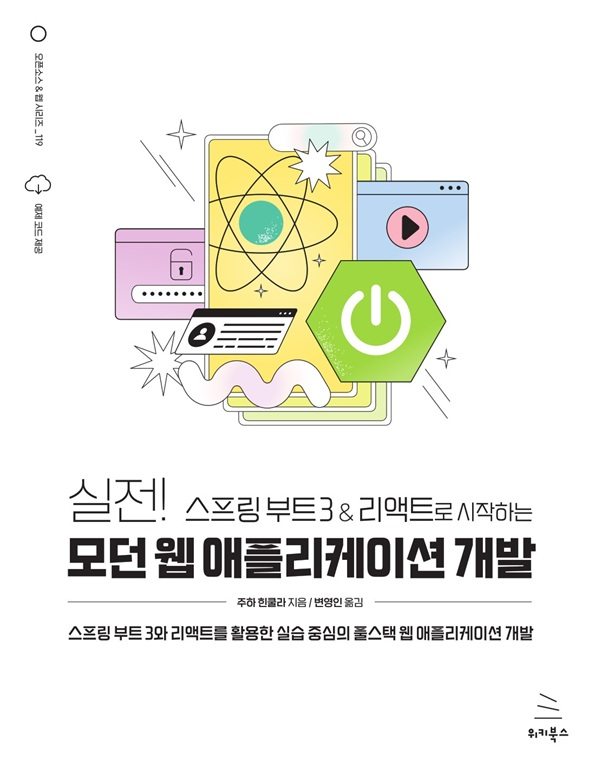

# 실전! 스프링 부트 3 & 리액트로 시작하는 모던 웹 애플리케이션 개발
### 스프링 부트 3와 리액트를 활용한 실습 중심의 풀스택 웹 애플리케이션 개발

- **주하 힌쿨라** 지음 | **변영인** 옮김
- ISBN: 9791158395315
- 판형: 188\*240\*17mm
- 30,000원 | 2024년 12월 12일 발행 | 404쪽
- [책 홈페이지](https://wikibook.co.kr/springboot3-react/)
- [도서 미리보기](http://www.yes24.com/Product/Viewer/Preview/139860417)
- [도서 관련 문의](https://wikibook.co.kr/support/contact/)

---

**스프링 부트와 리액트의 풍부하고 다양한 도구들을 활용해 최신 풀스택 애플리케이션 개발 비법을 배워보자!**

이 책은 풀스택 개발자로 전환하고자 하는 자바 개발자나 새 프런트엔드 프레임워크를 배우고 싶은 사람을 위한 간결한 리액트 입문서다. 이 책은 세 부분으로 되어 있으며, 스프링 부트 백엔드, 리액트 프런트엔드를 만들고 이를 함께 배포하는 과정을 다룬다. 

이번 개정판은 스프링 부트 3에 맞춰 업데이트되었으며, 보안과 테스트에 관한 내용을 좀 더 자세히 다루고 있다. 그리고 최근 인기가 높은 타입스크립트를 활용한 리액트 개발에 관한 내용이 추가됐다. REST API 생성, 애플리케이션 테스트, 보안 및 배포에 필요한 요소들을 알아보고 커스텀 훅, 서드파티 컴포넌트, MUI에 대해서도 배울 수 있다. 

이 책을 통해 최신 도구와 최근 모범 사례를 통해 풀스택 애플리케이션 개발 능력을 기를 수 있을 것이다.
 
**★ 이 책에서 다루는 내용 ★**

- 스프링 데이터 REST로 빠르고 RESTful한 웹서비스 개발
- ORM, JPA, 하이버네이트 등을 이용한 데이터베이스 생성 및 관리
- 단위 테스트와 스프링 시큐리티를 이용한 JWT
- 리액트 훅, 프롭, 상태 등을 이용하여 프런트엔드 개발
- 머티리얼 UI 컴포넌트 라이브러리로 프런트엔드 커스터마이징
- fetch API, Axios, 리액트 쿼리를 통한 네트워킹
- 애플리케이션에 CRUD 기능 추가
- AWS와 Docker를 이용한 애플리케이션 배포

---
 
 ## 구입처
 
 - [예스24](https://www.yes24.com/Product/Goods/139860417)
 - [교보문고](https://product.kyobobook.co.kr/detail/S000214896424)
 - [쿠팡](https://www.coupang.com/vp/products/8486147908?itemId=24559369927)
 - [알라딘](https://product.kyobobook.co.kr/detail/S000214896424)